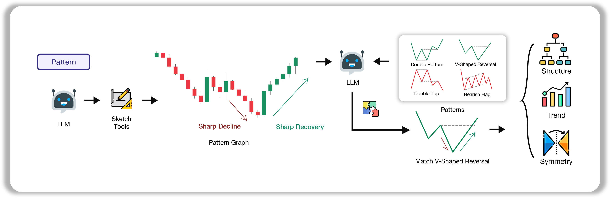
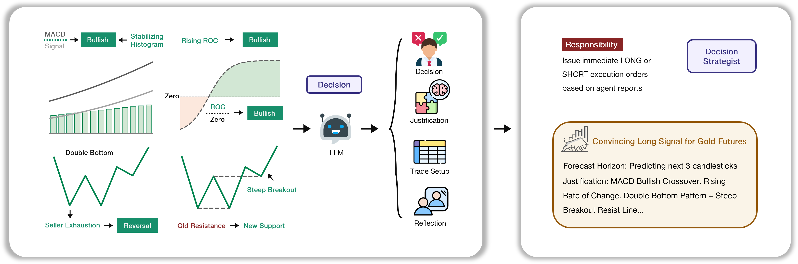

<div align="center">


<h2>QuantAgent: Price-Driven Multi-Agent LLMs for High-Frequency Trading</h2>

</div>


<div align="center">

<div style="position: relative; text-align: center; margin: 20px 0;">
  <div style="position: absolute; top: -10px; right: 20%; font-size: 1.2em;"></div>
  <p>
    <a href="https://machineily.github.io/">Fei Xiong</a><sup>1,2 ★</sup>&nbsp;
    <a href="https://wyattz23.github.io">Xiang Zhang</a><sup>3 ★</sup>&nbsp;
    <a href="https://scholar.google.com/citations?user=hFhhrmgAAAAJ&hl=en">Aosong Feng</a><sup>4</sup>&nbsp;
    <a href="https://intersun.github.io/">Siqi Sun</a><sup>5</sup>&nbsp;
    <a href="https://chenyuyou.me/">Chenyu You</a><sup>1</sup>
  </p>

  <p>
    <sup>1</sup> Stony Brook University &nbsp;&nbsp;
    <sup>2</sup> Carnegie Mellon University &nbsp;&nbsp;
    <sup>3</sup> University of British Columbia &nbsp;&nbsp; <br>
    <sup>4</sup> Yale University &nbsp;&nbsp;
    <sup>5</sup> Fudan University &nbsp;&nbsp;
    ★ Equal Contribution <br>
  </p>
</div>

<br>
<p align="center">
  <a href="https://arxiv.org/abs/2509.09995">
    
  </a>
  <a href="https://Y-Research-SBU.github.io/QuantAgent">
    
  </a>
  <a href="https://github.com/Y-Research-SBU/QuantAgent/blob/main/assets/wechat_0928.png">
    
  </a>
  <a href="https://discord.gg/K8DqX53q">
    
  </a>
</p>

</div>


A sophisticated multi-agent trading analysis system that combines technical indicators, pattern recognition, and trend analysis using LangChain and LangGraph. The system provides both a web interface and programmatic access for comprehensive market analysis.


<div align="center">

🚀 [Features](#-features) | ⚡ [Installation](#-installation) | 🎬 [Usage](#-usage) | 🔧 [Implementation Details](#-implementation-details) | 🤝 [Contributing](#-contributing) | 📄 [License](#-license)

</div>

## 🚀 Features

<!-- - **Multi-Agent Analysis**: Four specialized agents working together: -->

  ### Indicator Agent

  • Computes five technical indicators—including RSI to assess momentum extremes, MACD to quantify convergence–divergence dynamics, and the Stochastic Oscillator to measure closing prices against recent trading ranges—on each incoming K‑line, converting raw OHLC data into precise, signal-ready metrics.

  

 ### Pattern Agent

  • Upon a pattern query, the Pattern Agent first uses the agent draws the recent price chart, spots its main highs, lows, and general up‑or‑down moves, compares that shape to a set of familiar patterns, and returns a short, plain‑language description of the best match.

  

  ### Trend Agent

  • Leverages tool-generated annotated K‑line charts overlaid with fitted trend channels—upper and lower boundary lines tracing recent highs and lows—to quantify market direction, channel slope, and consolidation zones, then delivers a concise, professional summary of the prevailing trend.

  

  ### Decision Agent

  • Synthesizes outputs from the Indicator, Pattern, Trend, and Risk agents—including momentum metrics, detected chart formations, channel analysis, and risk–reward assessments—to formulate actionable trade directives, clearly specifying LONG or SHORT positions, recommended entry and exit points, stop‑loss thresholds, and concise rationale grounded in each agent’s findings.

  

### Web Interface
Modern Flask-based web application with:
  - Real-time market data from Yahoo Finance
  - Interactive asset selection (stocks, crypto, commodities, indices)
  - Multiple timeframe analysis (1m to 1d)
  - Dynamic chart generation
  - API key management

## 📦 Installation

### 1. Create and Activate Conda Environment

```bash
conda create -n quantagents python=3.10
conda activate quantagents
```

### 2. Install Dependencies

```bash
pip install -r requirements.txt
```

If you encounter issues with TA-lib-python,
try

```bash
conda install -c conda-forge ta-lib
```

Or visit the [TA-Lib Python repository](https://github.com/ta-lib/ta-lib-python) for detailed installation instructions.

### 3. Set Up OpenAI API Key
You can set it in our Web InterFace Later,


Or set it as an environment variable:
```bash
export OPENAI_API_KEY="your_api_key_here"
```


## 🚀 Usage

### Start the Web Interface

```bash
python web_interface.py
```

The web application will be available at `http://127.0.0.1:5000`

### Web Interface Features

1. **Asset Selection**: Choose from available stocks, crypto, commodities, and indices
2. **Timeframe Selection**: Analyze data from 1-minute to daily intervals
3. **Date Range**: Select custom date ranges for analysis
4. **Real-time Analysis**: Get comprehensive technical analysis with visualizations
5. **API Key Management**: Update your OpenAI API key through the interface

## 📺 Demo


## 🔧 Implementation Details


**Important Note**: Our model requires an LLM that can take images as input, as our agents generate and analyze visual charts for pattern recognition and trend analysis.

### Python Usage

To use QuantAgents inside your code, you can import the trading_graph module and initialize a TradingGraph() object. The .invoke() function will return a comprehensive analysis. You can run web_interface.py, here's also a quick example:

```python
from trading_graph import TradingGraph

# Initialize the trading graph
trading_graph = TradingGraph()

# Create initial state with your data
initial_state = {
    "kline_data": your_dataframe_dict,
    "analysis_results": None,
    "messages": [],
    "time_frame": "4hour",
    "stock_name": "BTC"
}

# Run the analysis
final_state = trading_graph.graph.invoke(initial_state)

# Access results
print(final_state.get("final_trade_decision"))
print(final_state.get("indicator_report"))
print(final_state.get("pattern_report"))
print(final_state.get("trend_report"))
```

You can also adjust the default configuration to set your own choice of LLMs, analysis parameters, etc.

```python
from trading_graph import TradingGraph
from default_config import DEFAULT_CONFIG

# Create a custom config
config = DEFAULT_CONFIG.copy()
config["agent_llm_model"] = "gpt-4o-mini"  # Use a different model for agents
config["graph_llm_model"] = "gpt-4o"       # Use a different model for graph logic
config["agent_llm_temperature"] = 0.2      # Adjust creativity level for agents
config["graph_llm_temperature"] = 0.1      # Adjust creativity level for graph logic

# Initialize with custom config
trading_graph = TradingGraph(config=config)

# Run analysis with custom configuration
final_state = trading_graph.graph.invoke(initial_state)
```

For live data, we recommend using the web interface as it provides access to real-time market data through yfinance_cache. The system automatically fetches the most recent 30 candlesticks for optimal LLM analysis accuracy.

### Configuration Options

The system supports the following configuration parameters:

- `agent_llm_model`: Model for individual agents (default: "gpt-4o-mini")
- `graph_llm_model`: Model for graph logic and decision making (default: "gpt-4o")
- `agent_llm_temperature`: Temperature for agent responses (default: 0.1)
- `graph_llm_temperature`: Temperature for graph logic (default: 0.1)

**Note**: The system uses default token limits for comprehensive analysis. No artificial token restrictions are applied.

You can view the full list of configurations in `default_config.py`.

## 🤝 Contributing

1. Fork the repository
2. Create a feature branch
3. Make your changes
4. Add tests if applicable
5. Submit a pull request

## 📄 License

This project is licensed under the MIT License - see the LICENSE file for details.

## 🔖 Citation
```
@article{xiong2025quantagent,
  title={QuantAgent: Price-Driven Multi-Agent LLMs for High-Frequency Trading},
  author={Fei Xiong and Xiang Zhang and Aosong Feng and Siqi Sun and Chenyu You},
  journal={arXiv preprint arXiv:2509.09995},
  year={2025}
}
```


## 🙏 Acknowledgements

This repository was built off of [**LangGraph**](https://github.com/langchain-ai/langgraph), [**OpenAI**](https://github.com/openai/openai-python), [**yfinance_cache**](https://github.com/dpguthrie/yfinance-cache), [**Flask**](https://github.com/pallets/flask), [**TechnicalAnalysisAutomation**](https://github.com/neurotrader888/TechnicalAnalysisAutomation/tree/main) and [**tvdatafeed**](https://github.com/rongardF/tvdatafeed).

## ⚠️ Disclaimer

This software is for educational and research purposes only. It is not intended to provide financial advice. Always do your own research and consider consulting with a financial advisor before making investment decisions.

## 🐛 Troubleshooting

### Common Issues

1. **TA-Lib Installation**: If you encounter TA-Lib installation issues, refer to the [official repository](https://github.com/ta-lib/ta-lib-python) for platform-specific instructions.

2. **OpenAI API Key**: Ensure your API key is properly set in the environment or through the web interface.

3. **Data Fetching**: The system uses Yahoo Finance for data. Some symbols might not be available or have limited historical data.

4. **Memory Issues**: For large datasets, consider reducing the analysis window or using a smaller timeframe.

### Support

If you encounter any issues, please:
1. Check the troubleshooting section above
2. Review the error messages in the console
3. Ensure all dependencies are properly installed
4. Verify your OpenAI API key is valid and has sufficient credits

## 📧 Contact

For questions, feedback, or collaboration opportunities, please contact:

**Email**: [chenyu.you@stonybrook.edu](mailto:chenyu.you@stonybrook.edu), [siqisun@fudan.edu.cn](mailto:siqisun@fudan.edu.cn)


## Star History

[](https://www.star-history.com/#Y-Research-SBU/QuantAgent&Date)
